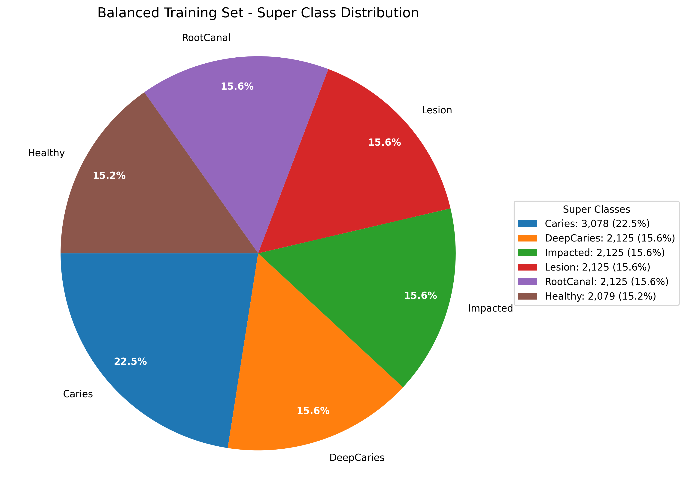
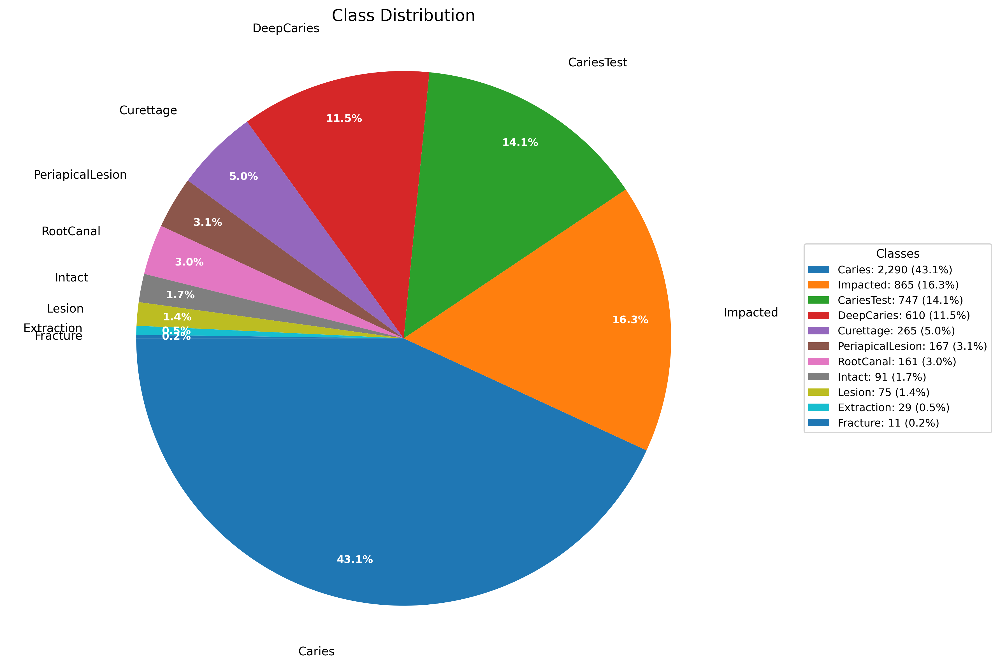
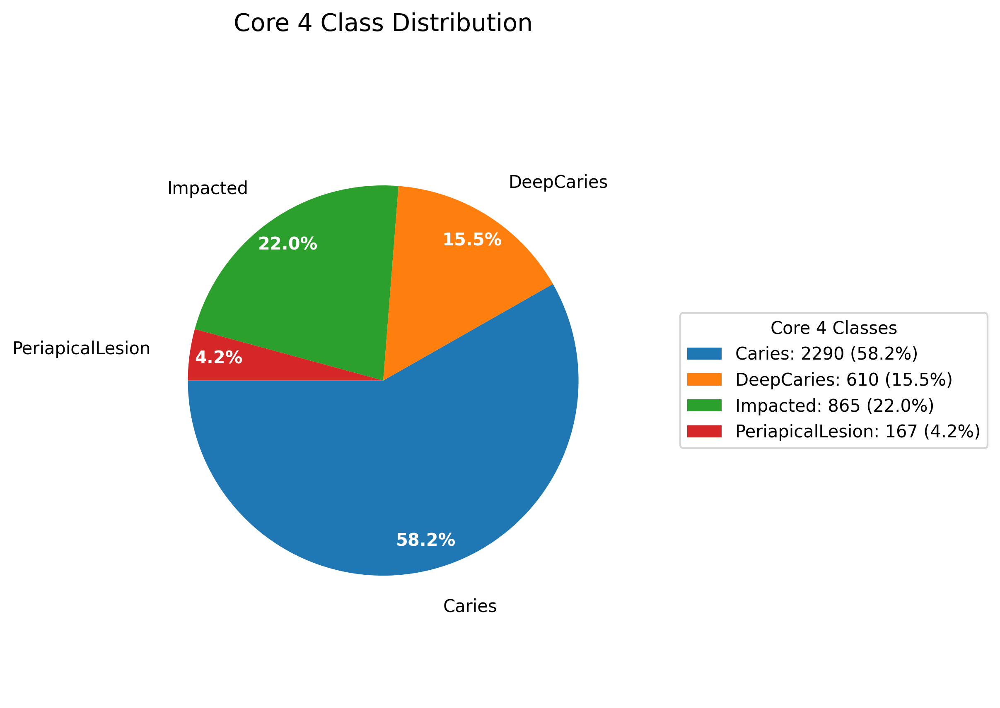

# DeepTeeth

Tooth disease classification using deep learning on the DENTEX dataset.

## Getting started
Install dependencies and run the data preprocessing scripts:

```
pip install -r requirements.txt
python split_data.py 
python augment_images.py 
python balance_training_data.py 
```

This should result in a 70/15/15 train/validation/test split into the `data_train`, `data_validation`, and `data_test` directories.  

A version of the training set that been balanced by oversampling the minority classes is labeled `data_balanced_train`. The class distribution in the balanced training set is shown below:


The super classes were created from the following mapping:
```python
SUPER_CLASSES = {
    "Caries": ["Caries", "CariesTest"],
    "DeepCaries": ["DeepCaries", "Curettage"],
    "Impacted": ["Impacted"],
    "Lesion": ["PeriapicalLesion", "Lesion"],
    "RootCanal": ["RootCanal"],
    "Healthy": ["Intact"],
}
EXCLUDED_CLASSES = ["Extraction", "Fracture"]
```

## Dataset

The DENTEX dataset has 3 types of training data:
- quadrant only (693 images)
- quadrant + enumeration (634 images)
- quadrant + enumeration + diagnosis (1005 images)
- *4th bonus type*: 1571 unlabeled images

For our classification task, we only care about the 3rd type: quadrant + enumeration + diagnosis (1005 images).

There are also validation (50 images) and test (250 images) sets. 

The training and validation sets use the 4 labels:
- Caries
- Deep Caries
- Periapical Lesion
- Impacted Tooth

<!-- core_map = {
    "Caries": ["Caries", "Curettage"],
    "Deep Caries": ["Curettage"],
    "Periapical Lesion": ["RootCanal"],
    "Impacted": ["Impacted"],
} -->

The test set which is stored under the `DENTEX/disease` directory uses 9 labels (which have been translated to English). With a bit of speculation, we can make use of some of these images by mapping them to the 4 labels we care about. Interestingly, we now have some samples of "healthy" teeth (labeled as "Intact") which we may consider using as a 5th class.
- Caries
    - Caries
- Deep Caries
    - Curettage
- Periapical Lesion
    - Lesion
- Impacted Tooth
    - Impacted
- Healthy (potential 5th class)
    - Intact
- Other (potential 6th class, probably not useful)
    - RootCanal
    - Extraction
    - Fracture

## EDA - Exploratory Data Analysis
The `eda.py` script does some basic EDA and generates a pie chart of the class distribution in the training set.


```
Total images: 5311
Class distribution:
  Caries: 2290 (43.1%)
  Impacted: 865 (16.3%)
  CariesTest: 747 (14.1%)
  DeepCaries: 610 (11.5%)
  Curettage: 265 (5.0%)
  PeriapicalLesion: 167 (3.1%)
  RootCanal: 161 (3.0%)
  Intact: 91 (1.7%)
  Lesion: 75 (1.4%)
  Extraction: 29 (0.5%)
  Fracture: 11 (0.2%)

Source distribution:
  train: 3529 (66.4%)
  validation: 182 (3.4%)
  test: 1600 (30.1%)
```


All files in the data directory follow the format:
sourcetype_classname_idx_imagefilename.png
where sourcetype is one of "train", "val", or "test"

The "source" name is how the data was organized in huggingface, but it does not necessarily represent how we will do our training/validation/testing splits.


## DENTEX 
File Structure:
```
├── README.md
├── data
│   ├── validation_PeriapicalLesion_1_val_14.png
│   ├── validation_PeriapicalLesion_1_val_14.png
│   └── validation_PeriapicalLesion_9_val_38.png
├── eda.py
├── load_test_data.py
└── load_train_data.py
```


### Setup

Source: [Dental Enumeration and Diagnosis on Panoramic X-rays Challenge DENTEX](https://huggingface.co/datasets/ibrahimhamamci/DENTEX)

prereq: [git-lfs](https://git-lfs.com/) installed.  
alternatively, download the zip files directly from the [DENTEX dataset page](https://huggingface.co/datasets/ibrahimhamamci/DENTEX) or use the huggingface datasets library.

```
git clone https://huggingface.co/datasets/ibrahimhamamci/DENTEX
cd DENTEX
unzip training_data.zip
unzip validation_data.zip
unzip test_data.zip
```

File Structure:
```
DENTEX
├── disease
│   ├── input
│   └── label
├── test_data.zip
├── training_data
│   ├── quadrant
│   ├── quadrant-enumeration-disease
│   ├── quadrant_enumeration
│   └── unlabelled
├── training_data.zip
├── validation_data
│   └── quadrant_enumeration_disease
├── validation_data.zip
└── validation_triple.json
```